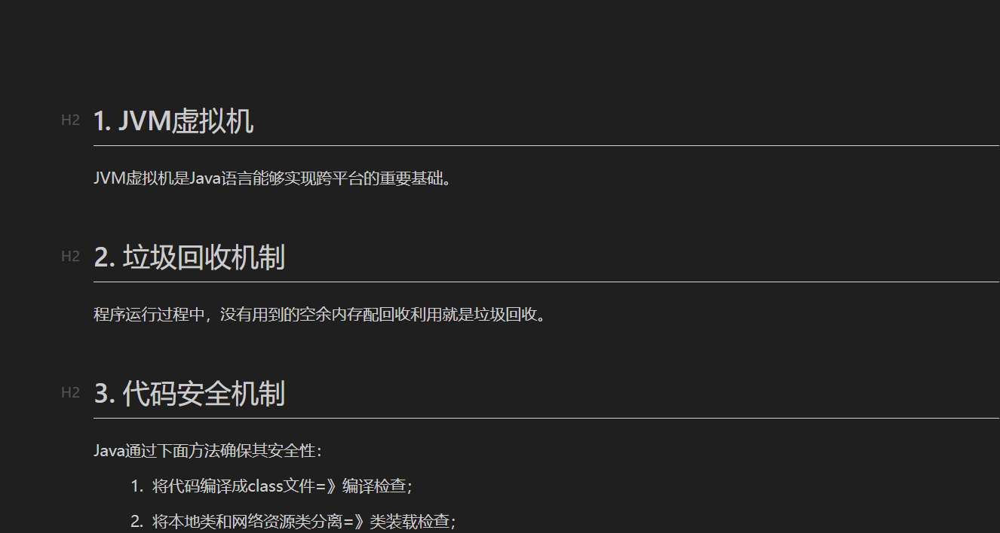

# Java编程3 - Java语言的三大优势

lin-jinwei

注意，未授权不得擅自以盈利方式转载本博客任何文章。

---

## 1. JVM虚拟机

JVM虚拟机是Java语言能够实现跨平台的重要基础。

## 2. 垃圾回收机制

程序运行过程中，没有用到的空余内存配回收利用就是垃圾回收。

## 3. 代码安全机制

Java通过下面方法确保其安全性：

1. 将代码编译成class文件=》编译检查；
2. 将本地类和网络资源类分离=》类装载检查；
3. 类装载后进行字节码校验；
4. 网络运行程序时使沙箱。
